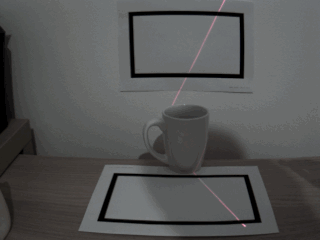
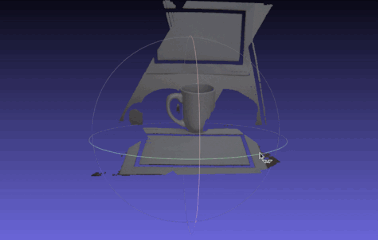
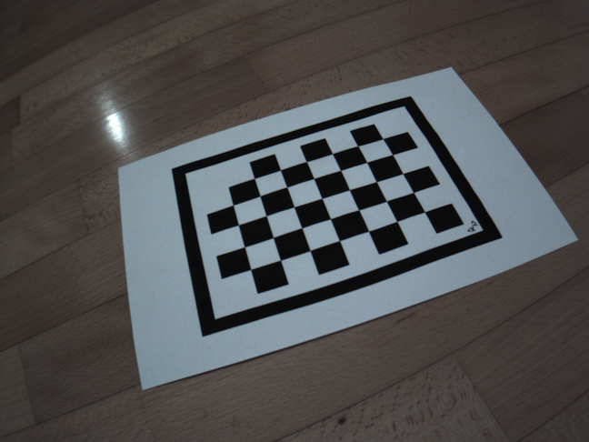
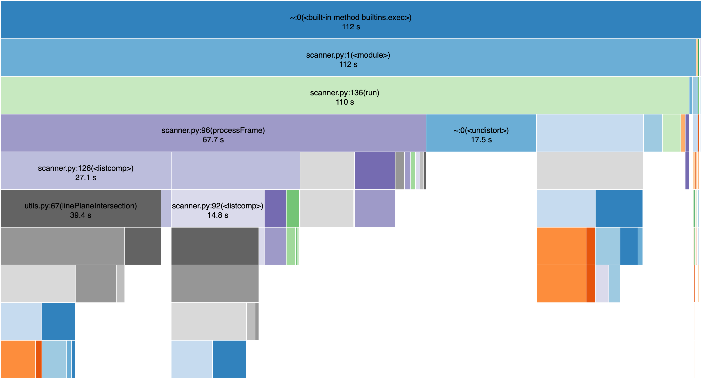

# laser-scanning

A 3D Scanner using Laser Structured Light, written in Python using OpenCV and NumPy.

### Input:



### Output (in PLY format):



_Source footage thanks to professor Filippo Bergamasco (Ca Foscari University of Venice)._

## Usage

### Camera Calibration

Before capturing the 3D model, a Camera Intrinsics calibration is expected. For this task you need to have some images with a calibration chessboard pattern. The calibration pattern is available in `patterns/chessboard.pdf`.



After capturing the images, put them in the `calibration_images` folder and run this command:

```
python3 cameraCalibrator.py -v
```

You can omit the `-v` option if you don't want to see debug output.

After the calibration is completed the result will be saved in `intrinsics.xml`, ready to be loaded by the scanner.

### Scanner

To start the scanner with a video file, run this command:

```
python3 scanner.py -v cup1.mp4
```

You can omit the `-v` option if you don't want to see debug output.

The resulting scan will be showed after finish and will be saved in `output.ply`.

You may need to adjust the HSV ranges for the laser in the head of `scanner.py`.

## Performance

The tests were performed on a MacBook Pro (i7-9750H @ 2.60GHz, 32Gb RAM DDR4, macOS 10.15.5).

| File name  | Video length | Total Processing Time | Frames Proc Time |
| ---------- | ------------ | --------------------- | ---------------- |
| cup1.mp4   | 62s          | 101s                  | 79s              |
| cup2.mp4   | 45s          | 89s                   | 66s              |
| puppet.mp4 | 53s          | 91s                   | 73s              |
| soap.mp4   | 72s          | 112s                  | 88s              |

We divided the time spent in initialization and mesh saving from the time spent in frame processing, to get a better estimate of the average frame processing time. Subtracting the frame time from the total time, we get an average of 19 seconds per video of fixed processing time.

Given that the videos are 15FPS, and considering only the frame processing time, the average processing time per frame is 0.092 seconds, with an average speed of 0.73x.

### Profiling

We run a benchmark with cProfile to measure the performance of the application:



Most of the time is spent in:

- **Line Plane Intersection** (~42%) – Difficult to do better in Python, since it involves a very long for loop, it may be useful to use less points
- **OpenCV Undistort** (~16%) – Unavoidable processing time, already highly optimized by OpenCV in C++
- **Ray Calculation** (~9%)
- **Plane Fitting** (~7%)
